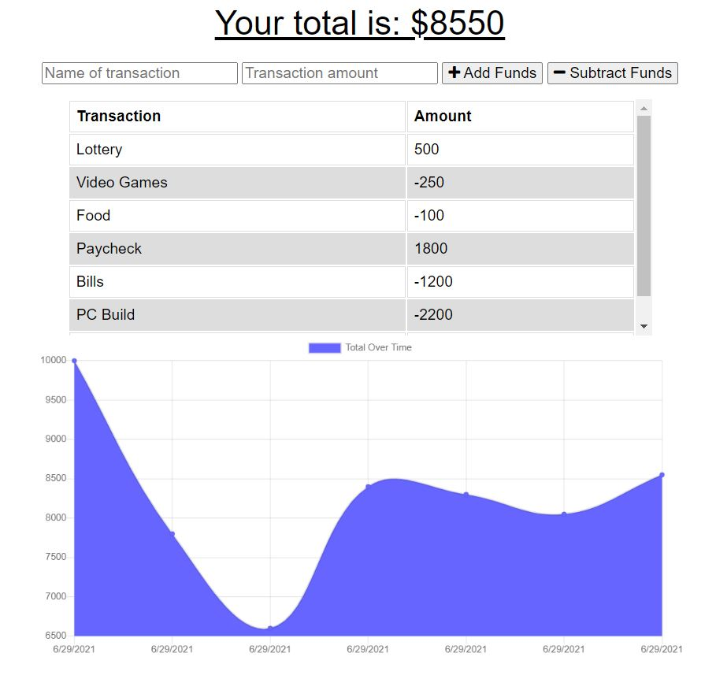

# Budget Tracker

# Table of Contents 

1. [Description](#description)
2. [Installation](#installation)
3. [Usage](#usage)
4. [Demo](#demo)
5. [Questions](#questions)

## Acceptance Criteria:

GIVEN a user is on Budget App without an internet connection
WHEN the user inputs a withdrawal or deposit
THEN that will be shown on the page, and added to their transaction history when their connection is back online.

## Description:

For this homework assignment, I was tasked with creating a budget tracker. I was given starter code and I was tasked with adding functionality to the existing Budget Tracker application to allow for offline access and functionality.
The user will be able to add expenses and deposits to their budget with or without a connection. When entering transactions offline, they should populate the total when brought back online.

Offline Functionality:

* Enter deposits offline
* Enter expenses offline
* When brought back online:
* Offline entries should be added to tracker.

## Installation:

To run this application, the following installs will be required:

    * npm i
    * compression
    * express
    * lite-server
    * mongoose
    * morgan
    * nodemon
        

## Usage:

This is intended to be used to keep track of a person's budget and spending habits. 

The following link will take you to the deployed application:
    
* https://fierce-coast-62825.herokuapp.com/

## Demo:
The following link is a video that will showcase how to run the application.

* https://www.youtube.com/watch?v=iGLKXjD92KU

## Questions: 
If there are any questions that you may have, please contact me by the following:

* Github: https://github.com/vickphat
* Email: vickphat@gmail.com 
